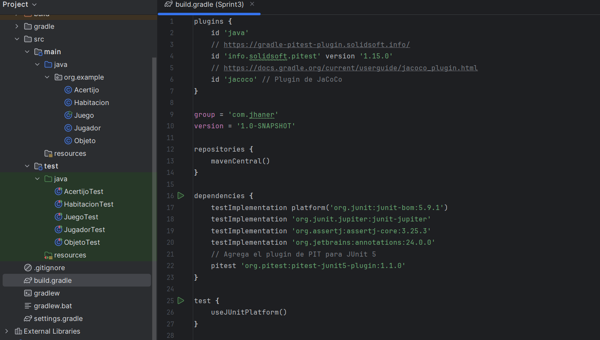

# Ejercicios

 2 . Implementar Jacoco para medir la cobertura de código del proyecto del juego y asegurarse de
que las pruebas cubran un alto porcentaje del código (5 puntos).

**Configurar Jacoco:**

- Añade Jacoco al proyecto de Java.

- Configura el build script (por ejemplo, en Maven o Gradle) para generar informes de
cobertura de código.

  Se agrega la configuracion al build.gradle
- 
  
**Ejecutar Jacoco:**
- Ejecuta las pruebas del proyecto y generar el informe de cobertura de Jacoco. 
- Analiza el informe para identificar áreas del código que no están cubiertas por las pruebas.

**Mejorar la cobertura:**
- Escribe alguna prueba adicionale para las partes del código que tienen baja cobertura. 
- Asegura de que las pruebas cubran diferentes escenarios y casos límite. 
- Genera un informe final de cobertura de código y presentarlo.

El informe generado nos muestra la cobertura d elas clases creadas, algunos test faltan agregar
  
Test agregados y actualizados, aun hay casos por validar

Aplicar TDD y mejorar la cobertura de código del proyecto mientras se refactoriza para adherirse a
  los principios SOLID. Usar Jacoco para medir la cobertura de código después de cada cambio.