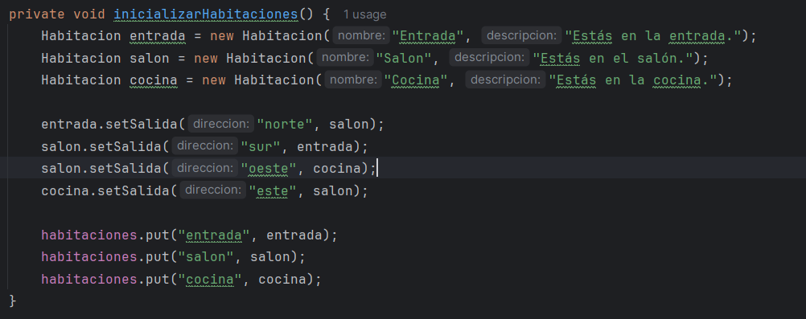

# Sprint 1: Estructura básica del juego y movimiento (3 puntos)
## Clases a implementar:
- Juego: Clase principal para iniciar y controlar el flujo del juego. 
- Habitación: Representa una habitación en el juego. 
- Jugador: Representa al jugador y rastrea su inventario y ubicación actual.

Se procede a crear las clases mencionadas:

**Habitacion.java:**

**Juego.java:**

**Jugador.java:**

## Tareas:
1. Inicialización del juego:
   - **Inicializa el juego con un conjunto de habitaciones.** 
      
      Se inicializa con solo 3 habitaciones (Salon, cocina, entrada) :
      
   
   - **Define la habitación inicial para el jugador.**
      
      En este caso el jugador empezara en la habitación entrada:
      
2. Movimiento del jugador:
   - **Permite al jugador moverse entre habitaciones usando comandos.**
      
      De esta manera podemos permitir al jugador moverse a la direccion que desee (las 4 mencionadas antes)
      
   
3. Interacción básica:
   - **Implementa comandos básicos para el movimiento (por ejemplo, "mover norte").**
      
     Se implemento la funcion procesarComandos para que el usuario escriba "mover norte", "mover sur", "mover este", "mover oeste"
     

## Enfoque TDD:
   - Escribe pruebas para la creación de habitaciones, movimiento del jugador e inicialización del
   juego.

      Se crea las clase de test de las 3 clases anteriores
      

      Clase Juego:
        
        

      Clase Jugador:

        
        
      Clase Habitacion:
        
      
      

## Salida:
   • Navegación funcional entre habitaciones.

   • Mostrar la descripción de la habitación actual al entrar.

En ete caso ya enviamos la direccion el norte y luego la dirección este, y nos indica la habitacion donde se entra.
   