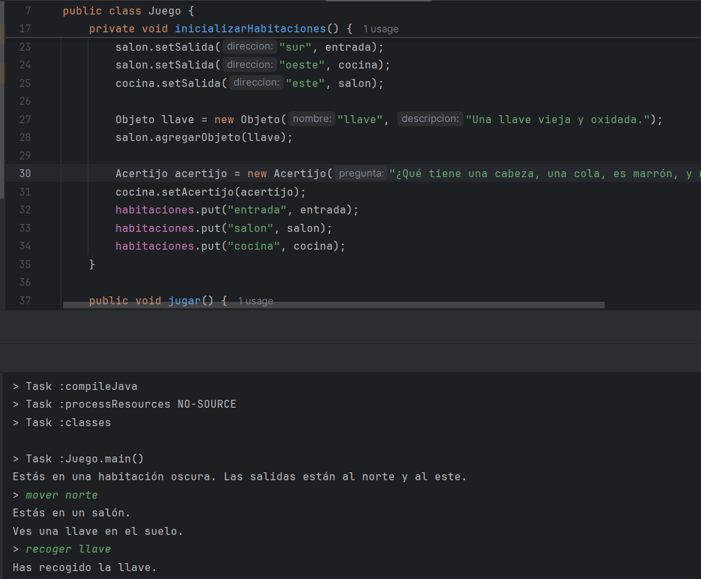

# Sprint 2: Recolección de objetos y resolución de acertijos (3 puntos)
## Clases a implementar:
• Objeto: Representa un objeto que puede ser recogido por el jugador.

• Acertijo: Representa un acertijo que necesita ser resuelto en el juego.

Se crea las clases Objeto y Acertijo :

Acertijo:

Objeto:

## Tareas:
   1. Gestión de Objetos:
   - Permitir a los jugadores recoger y usar objetos.

Se agregara a la clase jugador, los sigueintes metodos para poder hacer uso de los objetos:

   2. Integración de acertijos:
   - Implementar acertijos que los jugadores necesiten resolver para progresar.

Se agrega a la clase Habitación los siguientes metodos para poder hacer uso de los Acertijos

   3. Mejoras en la interacción:
   - Extender los comandos del jugador para incluir interacciones con objetos y acertijos.

Se le agrega a la funcion procesarComando para que asi pueda recoger objetos y resolver acertijos
     
## Enfoque TDD:
   - Escribir pruebas para la recogida de objetos, gestión de inventario y mecánicas de resolución de acertijos.

Se crea los 2 clases test nuevas:

**ObjetoTest:**

Se crea el objeto llave y su descripsion y luego se commpara el resultado obtenido con la descripcion original

**AcertijoTest:**

Para la prueba se agrega una pregunta y su respuesta, y se verifica con la respuesta correcta y una incorrecta donde debe resibirse una respuesta true y luego false.

Se agrega a los test anteriores nuevos casos para la evaluacion del objeto llave y acertijo

**JugadorTest:**

**HabitacionTest:**

## Salida:
   - Recolección y uso funcional de objetos.

   - Acertijos resolubles integrados en el flujo del juego.
